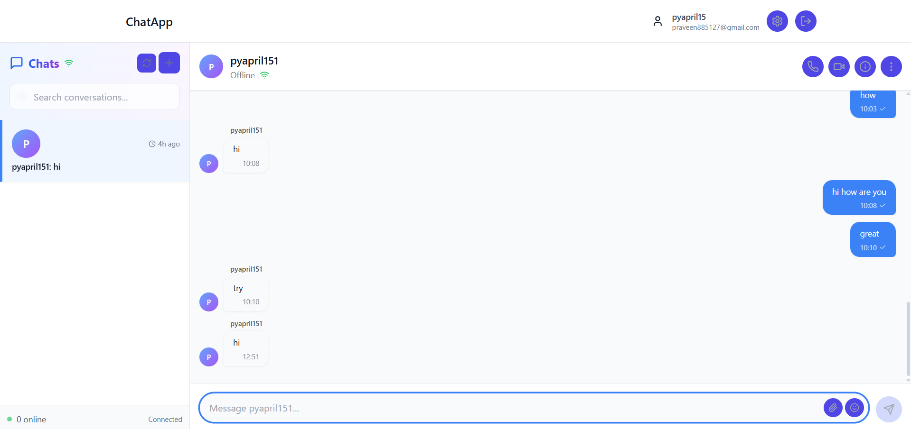
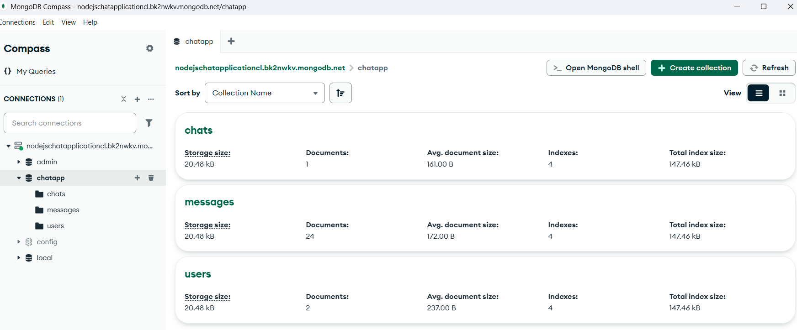

# 🚀 Real-Time Chat Application

A full-stack real-time chat application built with React, Express, WebSocket, MongoDB, and TypeScript. Features private messaging, group chats, typing indicators, online presence, and more.




## 📋 Features

- **Real-time messaging** with native WebSocket
- **JWT Authentication** for secure access
- **Private & Group Chats** with room management
- **Typing indicators** and online presence
- **Message history** with MongoDB persistence
- **File uploads** and emoji support
- **Read receipts** and message editing
- **Responsive design** for all devices

## 🏗️ Architecture

```
├── backend/          # Express + WebSocket + MongoDB
├── frontend/         # React + Vite + TypeScript
└── README.md
```

## 🛠️ Technologies

**Frontend:**
- React 18 with TypeScript
- Vite for development and building
- Native WebSocket API
- Tailwind CSS for styling
- Lucide React for icons

**Backend:**
- Node.js + Express + TypeScript
- Native WebSocket (ws library)
- MongoDB with Mongoose
- JWT for authentication
- Multer for file uploads

## 🚀 Quick Start

### Prerequisites

- Node.js 18+ and npm
- MongoDB Atlas account or local MongoDB
- Git

### 1. Clone and Install

```bash
# Clone the repository
git clone https://github.com/pyapril15/guvi-hcl-internship-project-2.git
cd guvi-hcl-internship-project-2

# Install backend dependencies
cd backend
npm install

# Install frontend dependencies
cd ../frontend
npm install
```

### 2. Environment Setup

**Backend** - Create `backend/.env`:
```env
# Server Configuration
PORT=5000
NODE_ENV=development

# MongoDB
MONGODB_URI=test_with_your_mongodb_uri

# JWT
JWT_SECRET=your-super-secret-jwt-key-here
JWT_EXPIRES_IN=7d

# CORS
CORS_ORIGIN=http://localhost:5173

# File Upload
MAX_FILE_SIZE=10485760
UPLOAD_PATH=uploads
```

**Frontend** - Create `frontend/.env`:
```env
VITE_API_URL=http://localhost:5000/api
VITE_WS_URL=ws://localhost:5000
VITE_MAX_FILE_SIZE=10485760
```

### 3. Run Locally

```bash
# Terminal 1 - Start Backend
cd backend
npm run dev

# Terminal 2 - Start Frontend
cd frontend
npm run dev
```

Visit `http://localhost:5173` to use the app!

1. **Deploy backend** to your platform:
   ```bash
   cd backend
   # Push to your deployment platform
   ```

2. **Set environment variables**:
   - `NODE_ENV=production`
   - `MONGODB_URI=your-production-mongodb-uri`
   - `JWT_SECRET=your-production-jwt-secret`
   - `CORS_ORIGIN=https://your-frontend-domain.vercel.app`


1. **Update frontend environment**:
   ```env
   VITE_API_URL=https://your-backend.onrender.com/api
   VITE_WS_URL=wss://your-backend.onrender.com
   ```

2. **Deploy frontend**:
   ```bash
   cd frontend
   npm run build
   # Deploy dist/ folder to Vercel/Netlify
   ```

## 📱 Usage

1. **Register/Login** - Create an account or sign in
2. **Start Chatting** - Click "New Chat" or join existing rooms
3. **Real-time Features** - See typing indicators, online status
4. **Group Chats** - Create rooms and invite multiple users
5. **Media Sharing** - Upload images and files in chats

## 🔧 Development

### Backend Commands
```bash
npm run dev        # Start development server
npm run build      # Build for production
npm start          # Start production server
npm run lint       # Run ESLint
```

### Frontend Commands
```bash
npm run dev        # Start development server
npm run build      # Build for production
npm run preview    # Preview production build
npm run lint       # Run ESLint
```

## 🧪 API Endpoints

### Authentication
- `POST /api/auth/register` - Register new user
- `POST /api/auth/login` - Login user
- `GET /api/auth/me` - Get current user

### Users
- `GET /api/users` - Get all users
- `GET /api/users/:id` - Get user by ID
- `PUT /api/users/:id` - Update user profile

### Chats
- `GET /api/chats` - Get user's chats
- `POST /api/chats` - Create new chat
- `GET /api/chats/:id` - Get chat by ID
- `POST /api/chats/:id/messages` - Send message

### WebSocket Events
- `connection` - User connects
- `disconnect` - User disconnects
- `join_room` - Join chat room
- `leave_room` - Leave chat room
- `send_message` - Send message
- `typing_start` - Start typing
- `typing_stop` - Stop typing

## 📄 License

MIT License - see LICENSE file for details

## 🤝 Contributing

1. Fork the repository
2. Create a feature branch
3. Commit your changes
4. Push to the branch
5. Open a Pull Request

## 📞 Support

For support, email support@chatapp.com or create an issue in the repository.